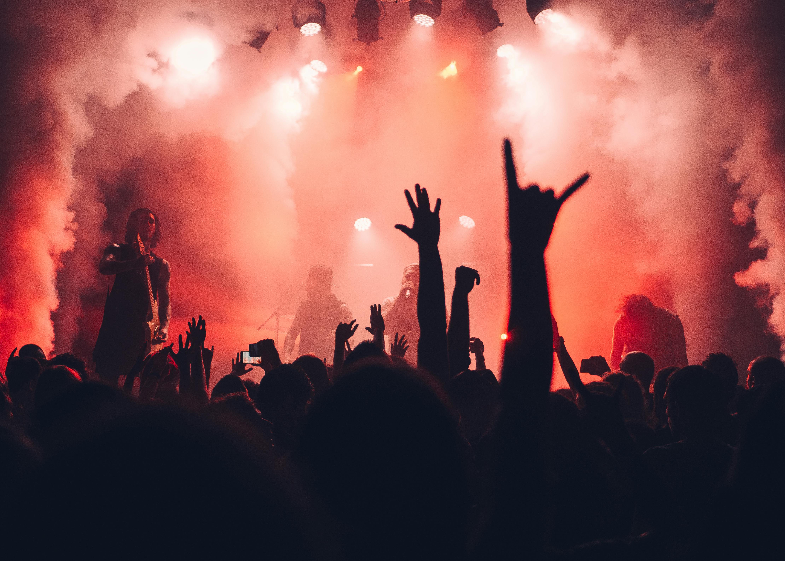
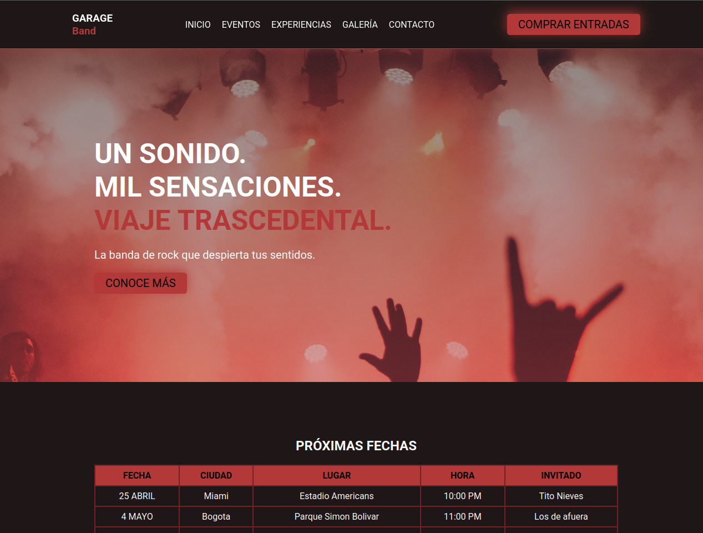
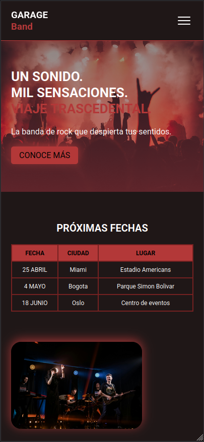

# GARAGE Band Landing Page



## ✨ Modern Landing Page for a GARAGE Band

A visually rich, responsive landing page designed to showcase a night-time GARAGE Band. This project brings together event highlights, theme zones, accessible patterns, and a mobile-first navigation flow.

---

## 🚀 Quick Preview

- Dark, immersive design with festival-inspired accents.
- Fully responsive layout for desktop, tablet, and mobile.
- Semantic HTML with accessible form controls and navigation.
- External JavaScript handles the mobile hamburger menu.

---

## 📸 Screenshots

| Desktop View | Mobile View |
|---|---|
|  |  |

---

## ✨ What’s Included

| Section | Purpose | Benefit |
|---|---|---|
| Hero | Festival headline and primary CTA | Strong first impression |
| Upcoming Events | Event schedule with city, venue and highlight | Clear festival agenda |
| Festival Overview | About section describing the experience | Build anticipation |
| Thematic Zones | Cards for cuisine, drinks and music | Visual structure and storytelling |
| Gallery | Featured rock images | Visual appetite appeal |
| Newsletter | Email capture with accessible label | Audience connection |
| Footer | Quick links, social buttons and contact | Easy site navigation |

---

## 🧠 Features

- **Responsive navigation**: mobile menu with overlay, keyboard handling, and `aria-expanded` state.
- **Accessible HTML**: semantic structure, visible labels, `caption` in tables, and icon `aria-labels`.
- **Clean CSS architecture**: theme variables, desktop-first layout, and responsive breakpoints.
- **External JavaScript**: menu behavior separated from markup for maintainability.
- **Modern typography**: Google Fonts for polished headings and body text.

---

## 🛠 Technologies

- **HTML5**
- **CSS3**
- **JavaScript**
- **Font Awesome**
- **Google Fonts**

---

## 📁 Project Structure

```text
PRUEBA-DESEMPEÑO/
├── assets/
│   ├── icons/          # Footer social icons
│   ├── images/         # Festival and band visuals
│   └── js/             # JavaScript for mobile menu
├── css/
│   └── style.css       # Main stylesheet with responsive design
├── index.html          # Landing page markup
└── README.md           # Project documentation
```

---

## ⚡ Setup

1. Clone or download the repository.
2. Open the project folder.
3. Launch `index.html` in a modern browser.

> No package manager or build process is required — this is a static HTML/CSS/JS site.

---

## ▶️ Usage

Open the file directly or host it with a static server to preview the landing page. It is optimized for modern browsers and mobile devices.

---

## 💡 Notes

- Replace footer social links with real URLs if you connect live channels.
- The layout is ready for enhancements like animations, light/dark toggles, or multilingual content.
- The hero background and gallery images are included for visual presentation.

---

## 👤 Author

Dylan Alberto Suarez Laverde

---

## 🙌 Acknowledgments

- Font Awesome for icon support.
- Google Fonts for typography.
- GARAGE Band landing page design inspiration.
